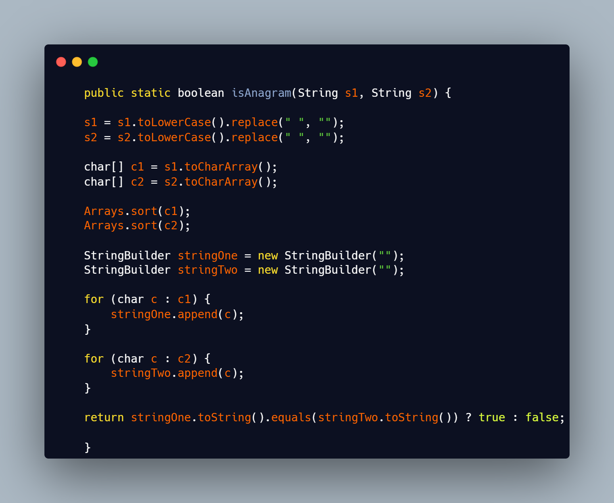

## Java Coding Daily - @Ricardo Ferreira
The more senior you are the more you're involved with mentoring, helping, monitoring, discussing ideas and you have less time dedicated to code what is the most important activity for a programmer.
To keep up with the recent developments and evolution of Java language there is no other solution than coding as much as you can, revisiting concepts, ideas, suggestions, doubts etc...
Here I have meet my peace of mind and happiness in coding as much as I can.
There are a bunch of challenges resolved my way. What I mean by that? No copy/paste from anywhere, doesn't matter the outcome of my solution. Sometimes you will find O(1) solutions but sometimes you will find some O(n2). So the deal is... Try to improve it and open up a PR...

## _Tools_
- Java 17
- IntelliJ Community Edition

## _Table of contents_
- [Java Coding Daily - @Ricardo Ferreira](#java-coding-daily---ricardo-ferreira)
- [_Tools_](#tools)
- [_Table of contents_](#table-of-contents)
- [_Screenshot_](#screenshot)
- [_Links_](#links)
- [_Built with_](#built-with)
- [_What I practiced_](#what-i-practiced)
- [_Continued development_](#continued-development)
  - [_Useful resources_](#useful-resources)
- [_Author_](#author)
- [Acknowledgments](#acknowledgments)


## _Screenshot_
[]()
## _Links_
- Live Site URL: [] 
## _Built with_

  | !
 ## _What I practiced_
```java
package streamChallengeTwo.application;

import polimorfism.entities.Employee;
import streamChallengeTwo.entities.Employex;

import java.io.*;
import java.util.ArrayList;
import java.util.List;
import java.util.Scanner;

/**
 * Fazer um programa para ler os dados (nome, email e salário)
 * de funcionários a partir de um arquivo em formato .csv.
 * Em seguida mostrar, em ordem alfabética, o email dos
 * funcionários cujo salário seja superior a um dado valor
 * fornecido pelo usuário.
 * Mostrar também a soma dos salários dos funcionários cujo
 * nome começa com a letra 'M'.
 * Execution:
 * Input:-> 
 * Enter salary: 2000.00
 * Output:->
 * Email of people whose salary is more than 2000.00:
 * anna@gmail.com
 * bob@gmail.com
 * maria@gmail.com
 * Sum of salary of people whose name starts with 'M': 4900.00
 */
public class StreamChallengeTwo {
  public static void main(String[] args) {
    String path = "/home/rferreira/dev/javaLearning/employee.csv";

    String line = null;
    List<Employex> listEmployees = new ArrayList<Employex>();
    try (BufferedReader br = new BufferedReader(new FileReader(path))) {

      while ((line = br.readLine()) != null) {

        String[] lines = line.split(",");
        listEmployees.add(new Employex(lines[0], lines[1], Double.parseDouble(lines[2])));

      }
      Scanner sc = new Scanner(System.in);
      System.out.print("Enter salary: ");
      double salary = sc.nextDouble();

      System.out.println("Email of people whose salary is more than " + String.format("%.2f",salary));

      List<String> email= listEmployees
              .stream()
              .filter(x ->x.getSalary()>salary)
              .map(Employex::getEmail)
              .toList();

      email.forEach(System.out::println);

      double sum = listEmployees
              .stream()
              .filter(x -> x.getName().startsWith("M"))
              .map(Employex::getSalary)
              .reduce(0.0, (x,y) -> x+y);

      System.out.print("Sum of salary of people whose name starts with 'M': " + String.format("%.2f",sum));

    } catch (FileNotFoundException ex) {
      System.out.println("Error: " + ex.getMessage());
    } catch (IOException ex) {
      System.out.println();
    }
  }
}

``` 

## _Continued development_
- Next step: Java 21 Virtual Threads.
### _Useful resources_
- [https://docs.oracle.com/en/java/] Always trust and read the official documentation!

## _Author_
- Website - [https://ferreiras.dev.br] 
## Acknowledgments
